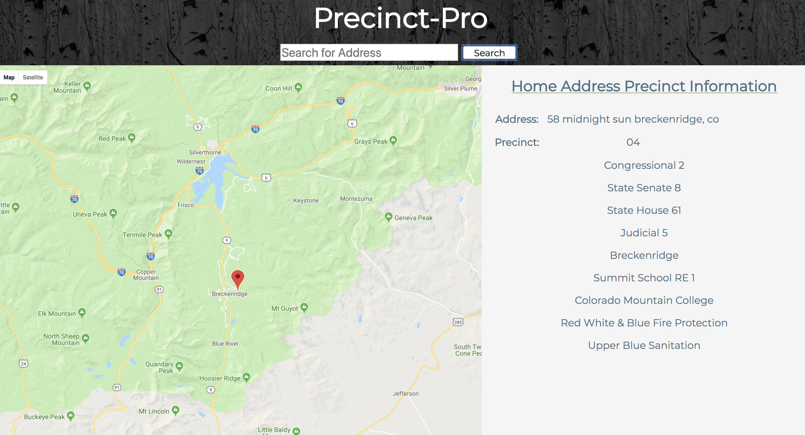

# Summit County Precinct Finder

## Overview
Precinct-Pro was a three week long individual project of our own choosing. A user would type in their home address and the map marker would move to the address, and display the precinct and the split information (think of a split as divided up precinct) they belonged tooI. For instance one precinct may have 1 split or 8.  I really enjoyed making this application because I loved the idea that this application, which I have demoed for the Summit County Commissioners has a real world application that people could use.

## Areas of Focus
This was a personal project built with React, Redux, Papa-parse,  SCSS, and Google Maps API.  I had a large excel spread that had to be parsed into a json object and the data had to be cleaned in a way that made the data usable in the way I wanted, and match up the correct split number to show the correctly corresponding information. By far the hardest part was working with a CSV for the time and manuiplating the data in a way that was usable.
