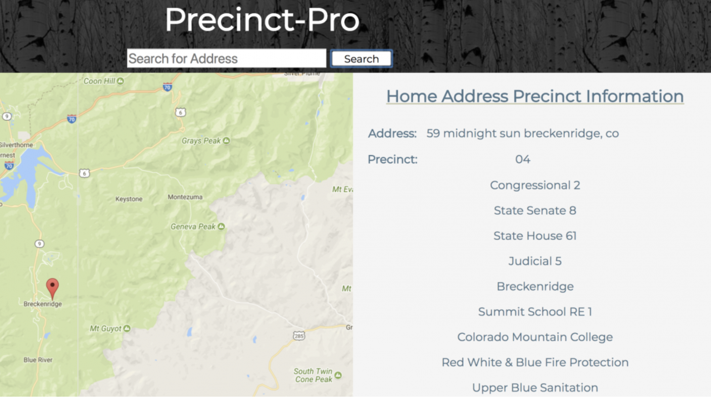

## Precinct-Pro was a three week long individual project of our own choosing. Where a user could input their address and the map would show their address with a marker, and display the information that corresponds with their precinct information. 

* Tech Stack: React, SASS, Redux, PapaParse
* APIs Used: Google Geocoding

